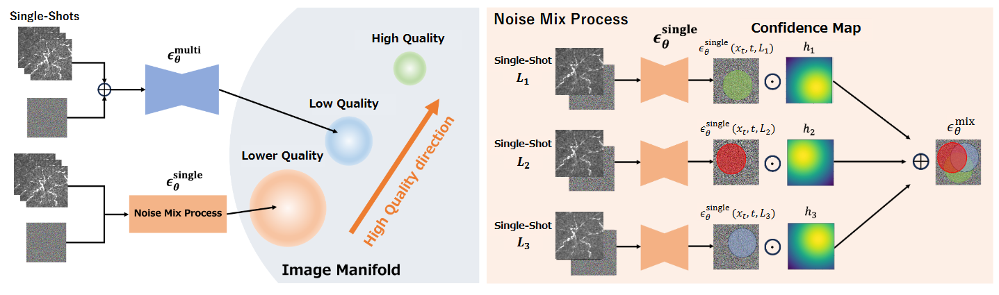

> Photoacoustic(PA) imaging is a non-destructive and non-invasive technology for visualizing minute blood vessel structures in the body using ultrasonic sensors. In PA imaging, the image quality of a single-shot image is poor, and it is necessary to improve the image quality by averaging many single-shot images. Therefore, imaging the entire subject requires high imaging costs. In our study, we propose a method to improve the quality of PA images using diffusion models. In our method, we improve the reverse diffusion process using sensor information of PA imaging and introduce a guidance method using imaging condition information to generate high-quality images.

Please read the [paper](https://arxiv.org/abs/2502.06354) for more details.
