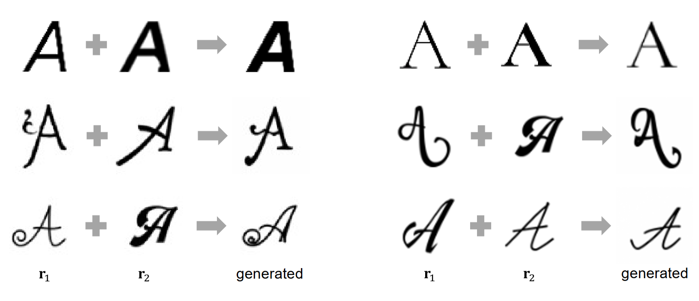

> Fonts have huge variations in their styles and give readers different impressions. Therefore, generating new fonts is worthy of giving new impressions to readers. In this paper, we employ diffusion models to generate new font styles by interpolating a pair of reference fonts with different styles. More specifically, we propose three different interpolation approaches, image-blending, condition-blending, and noise-blending, with the diffusion models. We perform qualitative and quantitative experimental analyses to understand the style generation ability of the three approaches. According to experimental results, three proposed approaches can generate not only expected font styles but also somewhat serendipitous font styles. We also compare the approaches with a state-of-the-art style-conditional Latin-font generative network model to confirm the validity of using the diffusion models for the style interpolation task.

Please read the [paper](https://arxiv.org/abs/2402.14311) for more details.
