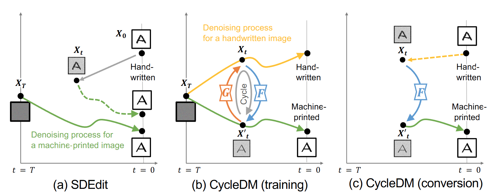

> The purpose of this paper is to enable the conversion between machine-printed character images (i.e., font images) and handwritten character images through machine learning. For this purpose, we propose a novel unpaired image-to-image domain conversion method, CycleDM, which incorporates the concept of CycleGAN into the diffusion model. Specifically, CycleDM has two internal conversion models that bridge the denoising processes of two image domains. These conversion models are efficiently trained without explicit correspondence between the domains. By applying machine-printed and handwritten character images to the two modalities, CycleDM realizes the conversion between them. Our experiments for evaluating the converted images quantitatively and qualitatively found that ours performs better than other comparable approaches.

Please read the [paper](https://arxiv.org/abs/2403.02919) for more details.
