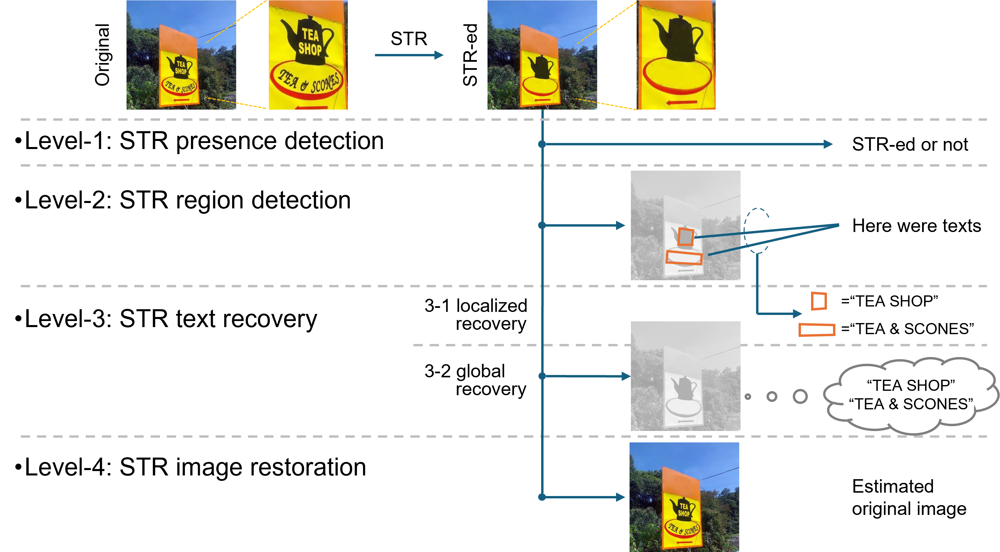

> Scene text removal (STR) aims to erase textual elements from images. It was originally intended for removing privacy-sensitive or undesired texts from natural scene images, but is now also applied to typographic images. STR typically detects text regions and then inpaints them. Although STR has advanced through neural networks and synthetic data, misuse risks have increased. This paper investigates Inverse STR (ISTR), which analyzes STR-processed images and focuses on binary classification (detecting whether an image has undergone STR) and localizing removed text regions. We demonstrate in experiments that these tasks are achievable with high accuracies, enabling detection of potential misuse and improving STR. We also attempt to recover the removed text content by training a text recognizer to understand its difficulty.

Please read the [paper]() for more details.
