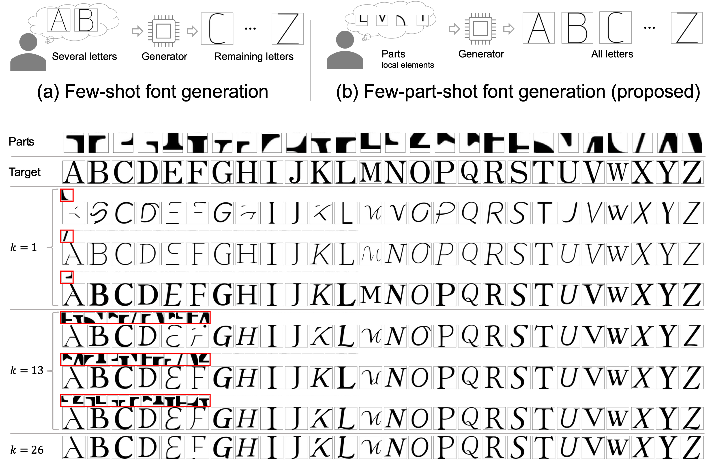

> This paper proposes a novel model of few-part-shot font generation, which designs an entire font based on a set of partial design elements, i.e., partial shapes. Unlike conventional few-shot font generation, which requires entire character shapes for a couple of character classes, our approach only needs partial shapes as input. The proposed model not only improves the efficiency of font creation but also provides insights into how partial design details influence the entire structure of the individual characters.

Please read the [paper]() for more details.
