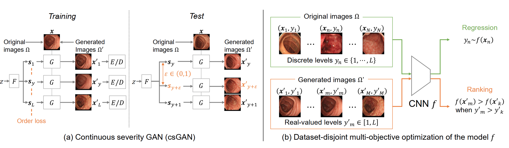

> Disease severity regression by a convolutional neural network (CNN) for medical images requires a sufficient number of image samples labeled with severity levels. Conditional generative adversarial network (cGAN)-based data augmentation (DA) is a possible solution, but it encounters two issues. The first issue is that existing cGANs cannot deal with real-valued severity levels as their conditions, and the second is that the severity of the generated images is not fully reliable. We propose continuous DA as a solution to the two issues. Our method uses continuous severity GAN to generate images at real-valued severity levels and dataset-disjoint multi-objective optimization to deal with the second issue. Our method was evaluated for estimating ulcerative colitis (UC) severity of endoscopic images and achieved higher classification performance than conventional DA methods.

Please read the [paper](https://arxiv.org/abs/2302.12482) for more details.
