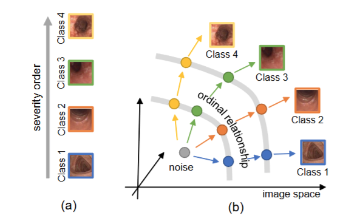

> Diffusion models have recently been used for medical image generation because of their high image quality. In this study, we focus on generating medical images with ordinal classes, which have ordinal relationships, such as severity levels. We propose an Ordinal Diffusion Model (ODM) that controls the ordinal relationships of the estimated noise images among the classes. Our model was evaluated experimentally by generating retinal and endoscopic images of multiple severity classes. ODM achieved higher performance than conventional generative models by generating realistic images, especially in high-severity classes with fewer training samples.

Please read the [paper](https://arxiv.org/abs/2403.00452) for more details.
