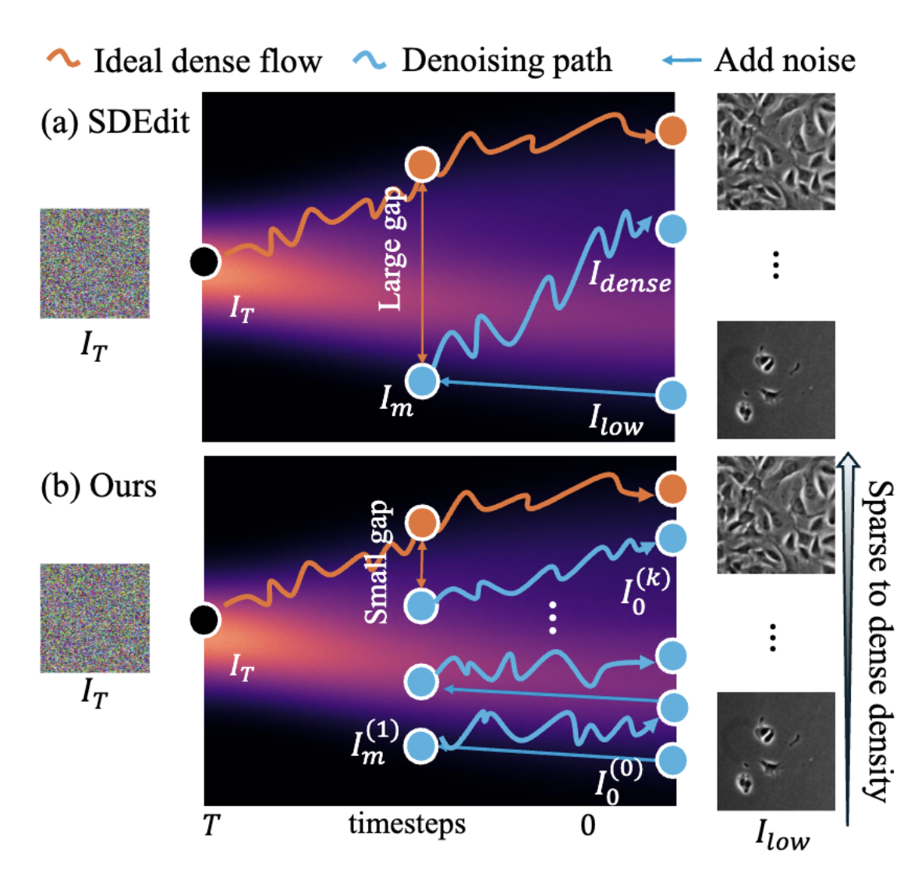

> High annotation costs are a significant barrier in time-lapse cell imaging, as cell density increases over time, leading to numerous adjoining and difficult-to-distinguish boundaries. Our work is based on the observation that sparse images, which are less costly to annotate, still contain local regions with cell densities comparable to those in dense data. We aim to generate dense data from these sparse images for data augmentation. While attempting to bridge the significant distribution gap between the training (sparse) and target (dense) data in a single large step is a viable approach, it can lead to instabilities in the generation process, resulting in unrealistic images. We find that generation is more stable when this gap is bridged incrementally. Therefore, we propose stepwise generation, a diffusion model based method that incrementally bridges this distribution gap. This approach successfully generates realistic images usable for augmentation. Furthermore, a cell detector trained with data augmented by the generated images achieved high detection accuracy (F1 score) on dense data, surpassing conventional methods.

Please read the [paper]() for more details.
