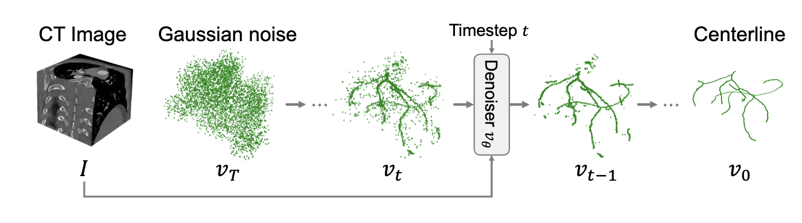

> Vessel centerline extraction from 3D CT images is an important task because it reduces annotation effort to build a model that estimates a vessel structure. It is challenging to estimate  natural vessel structures since conventional approaches are deterministic models, which cannot capture a complex human structure. In this study, we propose VesselFusion, which is a diffusion model to extract the vessel centerline from 3D CT image. The proposed method uses a coarse-to-fine representation of the centerline and a voting-based aggregation for a natural and stable extraction. VesselFusion was evaluated on a publicly available CT image dataset and achieved higher extraction accuracy and a more natural result than conventional approaches.

Please read the [paper](https://arxiv.org/abs/2603.08135) for more details.
